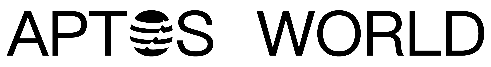

## 这里是Aptos World Community

- Twitter：[@aptosworld](https://twitter.com/aptosworld)
- Mirror: [0xptosworld.eth](https://mirror.xyz/0xaptosworld.eth)
- 微信公众号：[Aptos World](./src/Wechat.md)

### 愿景

### 定位

## 2. Aptos World 团队介绍
<table border="3">
<tr>
<td width=20% valign="top">

<a href="https://twitter.com/web3julian">Julian</a>

 
Move开发者关系维护，前Huobi Global公关内容负责人 前律动 Beats 记者 & 研究员

</td>
<td width=20% valign="top">

<a href="https://twitter.com/linda_guagua">Linda</a>

 
Move教育内容策划、开发者关系维护，Aptos、Sui华语区第一位研究布道者

</td>
<td width=20% valign="top">

<a href="./">WanXiang</a>

 
Move生态运营 
Web3社区运营专家 
Web3内容创作者

</td>
<td width=20% valign="top">

<a href="https://twitter.com/Bambibeer1">Christina</a>

 
Move生态运营，CGV FOF投资分析师，GameSpace、Carv咨询顾问，Ex-IBD at Barclays UK

</td>
<td width=20% valign="top">

<a href="https://twitter.com/jolestar">Jelestar</a>

 
Move导师与技术顾问，Move Language Contributor、Starcoin Core Developer、WestarLabs Chief Architect

</td>
</tr>
<tr>
<td width=25% valign="top">

<a href="https://twitter.com/Longdefi1">Jessi</a>

 
Move研究员与内容编辑，Rust资深研究员，Move学习者，前巴比特视频、活动栏目策划

</td>
<td width=25% valign="top">

<a href="https://twitter.com/0xyilu">0xyilu</a>

 
Move导师与技术顾问，MoveBit核心开发者，Ex-Lyft

</td>
<td width=25% valign="top">

<a href="https://twitter.com/chrissun12138">ChrisSun</a>

 
MoveLang Developer 
move语言课程讲师

</td>
<td width=25% valign="top">

<a href="https://twitter.com/haroldxuu_">Harold</a>

 
Move社区产品与黑客松运营，前百度生态开发者大会运营，阿里巴巴市场营销专家

</td>
<td width=25% valign="top">

<a href="https://twitter.com/gentlebreeze007">MengHuo</a>

 
Move生态社区运营，数字游民，瓦猫之夏的活动共建者。自媒体和社群运营达人

</td>
</tr>
<tr>
<td width=25% valign="top">

<a href="https://twitter.com/alalei_">alelei</a>

 
Move内容翻译与运营

</td>
<td width=25% valign="top">

<a href="https://twitter.com/no_buscando">Lucia</a>

 
Move 生态运营策划，Aptos生态研究员，清华英语和经金在读，目前商汤战投实习

</td>
<td width=25% valign="top">

<a href="https://twitter.com/qiyixx7171">qiyi</a>

 
Move内容翻译与运营

</td>
<td width=25% valign="top">

<a href="https://twitter.com/vivilinsv">Vivi</a>

 
Move内容制作与传播，前路透社财经主持人，
Near生态章鱼网络CMO

</td>
<td width=25% valign="top">

<a href="./">Chloe</a>

 
内容翻译与运营 
北大汇丰企业管理硕士

</td>
</tr>
</td>
<tr>
<td width=25% valign="top">

<a href="./">yulu</a>

 
move语言课程筹划 
Web3流量运营专家

</td>
<td width=25% valign="top">

<a href="./">Wind34</a>

 
Web3视频策划剪辑，新华社、芒果tv、抖音等丰富视频工作经验

</td>
</tr>
</table>

## 3. 已合作项目的展示

### Project Dashboard

## 更多

[内容资讯集合](./src/myPost.md)

## 5. Move语言学习包

## 6. 合作伙伴的资源

## 7. 招聘聚合